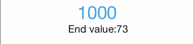

CXCountDownLabel
================

`CXCountDownLabel` is a subclass of UILabel. It provide an simple countdown animation.



##How to use
---

```Objective-C

- (void)setStartNumber:(NSInteger)startNumber endNumber:(NSInteger)endNumber countDownHandeler:(CXCountDownHandler)countDownHandeler;

- (void)start;
- (void)pause;
- (void)resume;

```

assign `countInterval` to decide your countdown speed.

##Contact
---
#### Chris Xu

 * [@GitHub](https://github.com/ChrisXu1221)
 * [@Twitter](https://twitter.com/taterctl)
 * [@Mail](mailto:taterctl@gmail.com)

##License
---
CXCountDownLabel is available under the MIT license. See the LICENSE file for more info. 

[](https://bitdeli.com/free "Bitdeli Badge")

